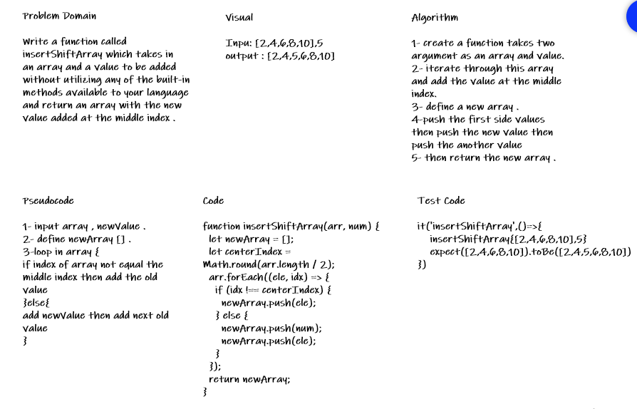

# Insert to Middle of an Array
 
 Adding number in the middle of the array

## Whiteboard Process

## Approach & Efficiency
<!-- What approach did you take? Discuss Why. What is the Big O space/time for this approach? -->

